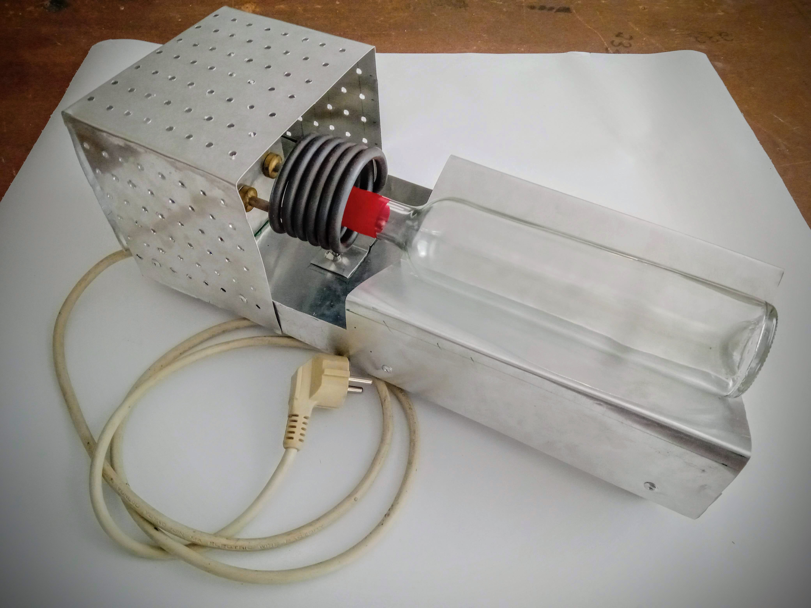

# CapsuladorTermico

## Descrição do projeto 

 Projeto desenvolvido por alunos do curso de Mecatronica da EPDRBM

O Capsulador é constituido por uma resistencia qua aquece e qaundo colocada a garafa com a capsula esta é lacrada com o aquecimento.
Desenhado em OpenShape

----------------
https://github.com/camilafernanda/GlicoCare/blob/main/README.md
